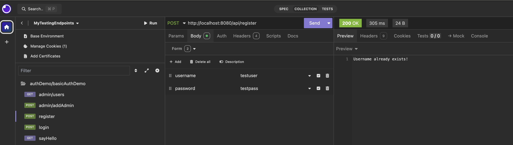

## Tutorial: Implementing Basic User Authentication Mechanism in Spring Boot with Kotlin and Spring Security 6
This will implement usr/password authentication. User details will be stored in a users table in a relational database (h2 here)

There will be several endpoints (defined across controllers `AdminController` and `UserController`):
- `/admin/addAdmin`: unauthenticated, adds a user with admin role
- `/api/register`: unauthenticated, adds a user with user role
- `/admin/users`: authenticated. returns a list of users in users table. only accessible to users with admin roles
- `/api/sayhello`: authenticated. returns a custom greeting message to user.

### Define User entity:

```kotlin
package com.dmrhimali.auth.basicAuth.model

import jakarta.persistence.*

@Entity
@Table(name = "users")
data class User(
    @Id
    @GeneratedValue(strategy = GenerationType.IDENTITY)
    val id: Long = 0,
    val username: String,
    val password: String,
    val role: String
)
{
    // Default constructor required by Hibernate
    constructor() : this(0, "", "", "")
}
```

corresponding table created using application.yml configuration: 
```roomsql
CREATE TABLE users (
    id BIGINT AUTO_INCREMENT PRIMARY KEY,
    username VARCHAR(255) NOT NULL UNIQUE,
    password VARCHAR(255) NOT NULL,
    role VARCHAR(100) NOT NULL
);
   
```

Define JPA UserRepository class:
```kotlin
package com.dmrhimali.auth.basicAuth.repository

import com.dmrhimali.auth.basicAuth.model.User
import org.springframework.data.jpa.repository.JpaRepository
import org.springframework.stereotype.Repository
import java.util.*

@Repository
interface UserRepository : JpaRepository<User, Long> {
    fun findByUsername(username: String): Optional<User>
}
```

###  Define Controllers

UserController:
```kotlin
package com.dmrhimali.auth.basicAuth.controller

import com.dmrhimali.auth.basicAuth.model.User
import com.dmrhimali.auth.basicAuth.repository.UserRepository
import jakarta.servlet.http.HttpServletResponse
import org.springframework.security.authentication.AuthenticationManager
import org.springframework.security.authentication.UsernamePasswordAuthenticationToken
import org.springframework.security.core.annotation.AuthenticationPrincipal
import org.springframework.security.core.context.SecurityContextHolder
import org.springframework.security.crypto.password.PasswordEncoder
import org.springframework.ui.Model
import org.springframework.web.bind.annotation.*

@RestController
@RequestMapping("/api")
class UserController(
    private val userRepository: UserRepository,
    private val passwordEncoder: PasswordEncoder,
) {

    // Registration Endpoint
    @PostMapping("/register")
    fun register(@RequestParam username: String, @RequestParam password: String): String {
        println("username = $username password = $password")
        // Check if username already exists
        if (userRepository.findByUsername(username).isPresent) {
            return "Username already exists!"
        }

        // Encode the password before saving
        val encodedPassword = passwordEncoder.encode(password)

        val newUser = User(
            username = username,
            password = encodedPassword,
            role = "USER")

        userRepository.save(newUser)
        return "User registered successfully"
    }

    // Hello Endpoint (only accessible to authenticated users)
    @GetMapping("/sayhello")
    fun sayHello(): String {
        println("saying hello")
        val authentication = SecurityContextHolder.getContext().authentication
        if (authentication == null || !authentication.isAuthenticated) {
            return "You are not authenticated!"
        }
        return "Hello, ${authentication.name}!"
    }

}

```

AdminController:
```kotlin
package com.dmrhimali.auth.basicAuth.controller

import com.dmrhimali.auth.basicAuth.model.User
import com.dmrhimali.auth.basicAuth.repository.UserRepository
import org.springframework.http.ResponseEntity
import org.springframework.security.access.prepost.PreAuthorize
import org.springframework.security.crypto.password.PasswordEncoder
import org.springframework.web.bind.annotation.*


@RestController
@RequestMapping("/admin")
class AdminController(
    private val userRepository: UserRepository,
    private val passwordEncoder: PasswordEncoder
) {
    // Endpoint to get all users, only accessible to admins
    @PreAuthorize("hasRole('ADMIN')")  // Ensure that only users with 'ADMIN' role can access
    @GetMapping("/users")
    fun getAllUsers(): List<User> {
        return userRepository.findAll()
    }

    // Endpoint to add a new admin user
    @PostMapping("/addAdmin")
    @PreAuthorize("hasRole('ADMIN')")  // Only allow admins to add new admins
    fun addAdmin(@RequestParam username: String, @RequestParam password: String): ResponseEntity<String> {
        // Check if the username already exists
        if (userRepository.findByUsername(username).isPresent) {
            return ResponseEntity.badRequest().body("Username already exists!")
        }

        // Encode the password before saving it
        val encodedPassword = passwordEncoder.encode(password)

        // Create a new User with ADMIN role
        val newAdmin = User(
            username = username,
            password = encodedPassword,
            role = "ADMIN"
        )

        // Save the new admin user
        userRepository.save(newAdmin)

        return ResponseEntity.ok("Admin user $username created successfully!")
    }
}
```

### Define Security Config
SecurityConfig:
```kotlin
package com.dmrhimali.auth.basicAuth.config


import com.dmrhimali.auth.basicAuth.repository.UserRepository
import org.springframework.context.annotation.Bean
import org.springframework.context.annotation.Configuration
import org.springframework.security.authentication.AuthenticationManager
import org.springframework.security.authentication.ProviderManager
import org.springframework.security.authentication.dao.DaoAuthenticationProvider
import org.springframework.security.config.annotation.web.builders.HttpSecurity
import org.springframework.security.config.annotation.web.configuration.EnableWebSecurity
import org.springframework.security.core.userdetails.User
import org.springframework.security.core.userdetails.UserDetailsService
import org.springframework.security.core.userdetails.UsernameNotFoundException
import org.springframework.security.crypto.bcrypt.BCryptPasswordEncoder
import org.springframework.security.crypto.password.PasswordEncoder
import org.springframework.security.web.SecurityFilterChain

@Configuration
@EnableWebSecurity(debug = true)
open class SecurityConfig(private val userRepository: UserRepository) {

    @Bean
    open fun securityFilterChain(http: HttpSecurity): SecurityFilterChain {
        http
            .authorizeHttpRequests { authz ->
                authz
                    .requestMatchers("/login", "/api/register", "/admin/addAdmin", "/logout").permitAll()  // Allow unauthenticated access to /login and /register
                    .requestMatchers("/api/sayhello").authenticated()    // Require authentication for /sayhello
                    .requestMatchers("/admin/users").hasRole("ADMIN")    // Require 'ROLE_ADMIN' to access /admin/users
                    .anyRequest().authenticated()                        // All other requests need authentication
            }
            .formLogin { formLogin ->
                formLogin
                    .loginProcessingUrl("/login")                         // Handle login POST request at /login
                    .defaultSuccessUrl("/api/sayhello", true)
                    .failureUrl("/login?error=true")                      // Redirect to /login if authentication fails
                    .permitAll()                                          // Allow unauthenticated access to /login
            }
            .logout { logout ->
                logout
                    .permitAll()                                          // Allow unauthenticated access to logout
            }
            .csrf { csrf ->
                csrf.disable()                                            // Disable CSRF for simplicity (enable for production)
            }
        return http.build() 
    }

    @Bean
    open fun authenticationManager(
        userDetailsService: UserDetailsService,
        passwordEncoder: PasswordEncoder): AuthenticationManager {
        val authenticationProvider = DaoAuthenticationProvider()
        authenticationProvider.setUserDetailsService(userDetailsService)
        authenticationProvider.setPasswordEncoder(passwordEncoder)

        return ProviderManager(authenticationProvider)
    }


    @Bean
    open fun userDetailsService(): UserDetailsService {
        return UserDetailsService { username ->
            val user = userRepository.findByUsername(username)
                .orElseThrow{UsernameNotFoundException("User not found")}

            User.builder()
                .username(user.username)
                .password(user.password)
                .roles(user.role)  // Role needs to be prefixed with "ROLE_" (e.g., "ROLE_USER")
                .build()
        }
    }

    @Bean
    open fun passwordEncoder(): PasswordEncoder = BCryptPasswordEncoder()
}
```

### Test endpoints

Run application.

- `/api/register`: (no authentication)
    ```shell
    curl --request POST \
  --url http://localhost:8080/api/register \
  --header 'Content-Type: application/x-www-form-urlencoded' \
  --header 'User-Agent: insomnia/10.3.0' \
  --cookie JSESSIONID=A7F95D5E8533B9665546A277D865AF18 \
  --data username=testuser \
  --data password=testpass
    ```
  

- `/admn/addAdmin`: (no authentication)
  ```shell
  curl --request POST \
  --url http://localhost:8080/admin/addAdmin \
  --header 'Content-Type: application/x-www-form-urlencoded' \
  --header 'User-Agent: insomnia/10.3.0' \
  --cookie JSESSIONID=A7F95D5E8533B9665546A277D865AF18 \
  --data username=testadmin \
  --data password=testadminpass
  ```
  

- `/login`
  ```shell
  curl --request POST \
  --url http://localhost:8080/login \
  --header 'Content-Type: application/x-www-form-urlencoded' \
  --header 'User-Agent: insomnia/10.3.0' \
  --cookie JSESSIONID=A7F95D5E8533B9665546A277D865AF18 \
  --data username=testadmin \
  --data password=testadminpass
  ```
  

- `/api/sayhello`: (authenticated)
  ```shell
  curl --request GET \
  --url http://localhost:8080/api/sayhello \
  --header 'Content-Type: application/x-www-form-urlencoded' \
  --header 'User-Agent: insomnia/10.3.0' \
  --cookie JSESSIONID=A7F95D5E8533B9665546A277D865AF18 \
  --data username=testadmin \
  --data password=testadminpass
  ```
  


- `/admin/users`: (authenticated, need ADMIN role user)
  
  once logged in using /login, you do not need to provide credentials anymore:
  ```shell
  curl --request GET \
  --url http://localhost:8080/admin/users \
  --header 'Content-Type: application/x-www-form-urlencoded' \
  --header 'User-Agent: insomnia/10.3.0' \
  --cookie JSESSIONID=5ACED15B2E3234697C9A08E78095B4F1 \
  --data =
  ```
  
