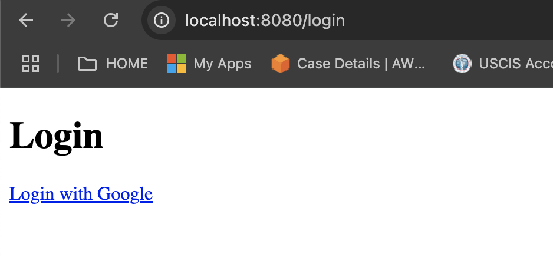
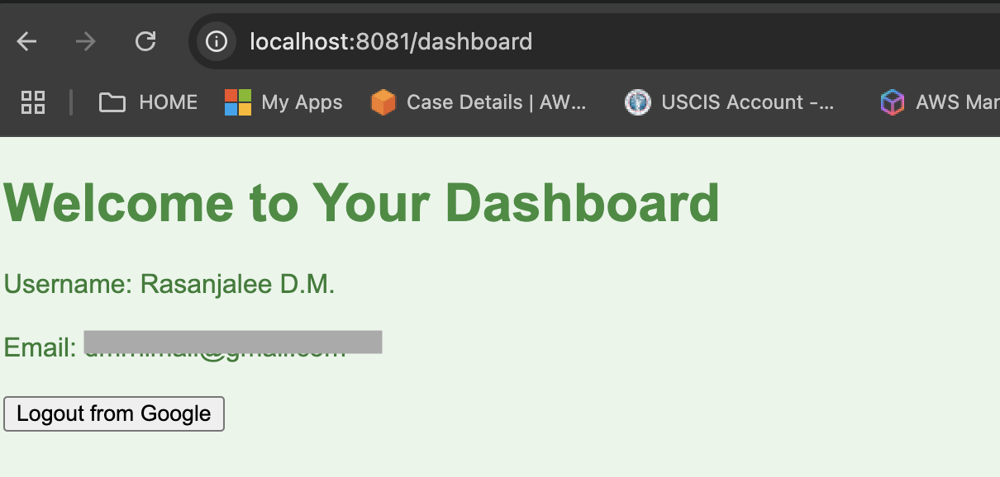
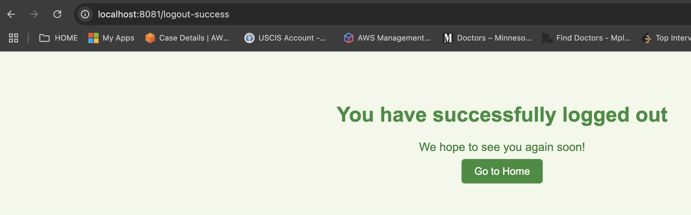

# SSO 

**SSO (Single Sign-On)** is an authentication mechanism that allows a user to log in once and gain access to multiple applications or services without being prompted to log in again for each service. This is useful for organizations and platforms that provide access to various services (e.g., Google services, Microsoft services, etc.) under one central user account.

### Key Features of SSO:
1. **Centralized Authentication**:
    - A single authentication point (e.g., Google, Facebook, or your company's identity provider) is used to access multiple services or applications.

2. **User Convenience**:
    - Users don’t need to remember multiple usernames and passwords for different services. Once logged in, they can access all authorized services seamlessly.

3. **Improved Security**:
    - Since users only need to authenticate once, the chances of weak or reused passwords across different applications are reduced.
    - Many SSO systems support multi-factor authentication (MFA) for an added layer of security.

4. **Reduced IT Overhead**:
    - Organizations only need to manage one authentication system for their users, simplifying user access control.

### How Does SSO Work?

1. **Authentication Process**:
    - A user attempts to access an application that is integrated with an SSO provider.
    - If the user is not logged in, they are redirected to the SSO provider (e.g., Google, Facebook).
    - The user authenticates with the SSO provider (typically with their username and password, and possibly additional factors like SMS or a security app).
    - The SSO provider sends an authentication token back to the application, confirming the user's identity.

2. **Authorization**:
    - The user is granted access to the requested application based on the information from the SSO token. This might include the user’s roles or permissions.

3. **Accessing Other Applications**:
    - Once logged in, the user doesn't need to re-authenticate to access other services that are part of the SSO network.

### Common SSO Protocols:
1. **OAuth 2.0**: Often used for authorization. It's widely adopted by third-party services like Google, Facebook, GitHub, etc.
2. **OpenID Connect**: Built on top of OAuth 2.0, OpenID Connect adds authentication features. It is used by Google and other large platforms.
3. **SAML (Security Assertion Markup Language)**: Often used in enterprise applications for web-based SSO. It allows identity providers (IdPs) to send user authentication data (assertions) to service providers (SPs).

### Examples of SSO Providers:
- **Google SSO**: Allows users to authenticate using their Google account to access applications like Gmail, Google Drive, etc.
- **Facebook Login**: Allows users to sign into third-party apps using their Facebook account.
- **Microsoft Identity**: Provides authentication for services like Microsoft 365, Azure, and other Microsoft services.

### Benefits of SSO:
- **Convenience for Users**: One password for multiple services.
- **Improved Security**: Stronger password policies, central monitoring of authentication events, and fewer login prompts.
- **Cost and Time Savings for IT**: Centralized user management.

### Example Use Case:

- A company uses Google’s identity platform for authentication. Employees can log into Gmail, Google Docs, and other Google Workspace apps using a single set of credentials.
- Similarly, if they have access to a third-party application that integrates with Google SSO, they can use the same login credentials without needing to enter them again.

---
### Common SSO Scenarios:

1. **Enterprise SSO**:
    - An enterprise may use an identity provider like **Active Directory** or **LDAP** and configure SSO to allow employees to access internal resources (e.g., email, HR apps, or CRM systems) with a single login.

2. **Social Login**:
    - Web apps or mobile apps allow users to log in using a social media account (e.g., Facebook, Google, Twitter).

---

## Google SSO
To integrate **Google SSO (Single Sign-On)** authentication in a **Spring Boot** application written in **Kotlin**, you can use **Spring Security** with **OAuth 2.0 Login**.

### Prerequisites:
- Java 17+ or Kotlin 1.5+.
- Spring Boot 3.x (which supports Spring Security 6).
- Google Cloud project with OAuth 2.0 credentials.
- A basic understanding of Spring Boot and Spring Security.

### Step 1: Create a Google OAuth 2.0 Application
1. **Go to the Google Cloud Console**:
    - Visit [Google Cloud Console](https://console.cloud.google.com/).
    - Create a new project if you don't have one already.

2. **Enable the OAuth consent screen**:
    - In the left sidebar, under **APIs & Services**, click on **OAuth consent screen**.
    - Choose **External** and fill in the required fields (app name, user support email, etc.).

3. **Create OAuth credentials**:
    - Go to **APIs & Services** → **Credentials**.
    - Click on **Create Credentials** and choose **OAuth 2.0 Client IDs**.
    - Select **Web application**.
    - Under **Authorized redirect URIs**, add the URI for your app, e.g., `http://localhost:8080/login/oauth2/code/google`.

4. **Get the credentials**:
    - After creating the credentials, you will get a **Client ID** and **Client Secret**. Keep these safe, as you will need them for configuration.

### Step 2: Set Up Spring Boot with Kotlin and Dependencies
In your Spring Boot project, you'll need the following dependencies for OAuth2 login.

#### `build.gradle.kts`

```kotlin
plugins {
    id("org.springframework.boot") version "3.0.0"
    id("io.spring.dependency-management") version "1.0.15.RELEASE"
    kotlin("jvm") version "1.7.10"
    kotlin("plugin.spring") version "1.7.10"
}

repositories {
    mavenCentral()
}

dependencies {
    implementation("org.springframework.boot:spring-boot-starter-web")
    implementation("org.springframework.boot:spring-boot-starter-thymeleaf")
    implementation("org.springframework.security:spring-security-oauth2-client")
    implementation("org.springframework.security:spring-security-oauth2-jose")
    implementation("org.springframework.boot:spring-boot-starter-data-jpa")
    implementation("org.springframework.boot:spring-boot-starter-validation")
    implementation("com.fasterxml.jackson.module:jackson-module-kotlin")
    implementation("org.springframework.boot:spring-boot-starter-log4j2")
    implementation("org.springframework.boot:spring-boot-starter-logging")
    
    runtimeOnly("org.springframework.boot:spring-boot-devtools")

    // Database (optional if you want to store user data)
    implementation("org.springframework.boot:spring-boot-starter-data-jpa")
    implementation("org.flywaydb:flyway-core")

    testImplementation("org.springframework.boot:spring-boot-starter-test")
}
```

This will add Spring Security OAuth2 client support, among other basic Spring Boot dependencies.

### Step 3: Configure Google OAuth2 in `application.yml`
In the `src/main/resources/application.yml` file, configure the OAuth2 login with your Google credentials.

#### `application.yml`

```yaml
spring:
  security:
    oauth2:
      client:
        registration:
          google:
            client-id: YOUR_GOOGLE_CLIENT_ID
            client-secret: YOUR_GOOGLE_CLIENT_SECRET
            scope:
              - profile
              - email
            redirect-uri: "{baseUrl}/login/oauth2/code/google"
            authorization-grant-type: authorization_code
            client-name: Google
        provider:
          google:
            authorization-uri: https://accounts.google.com/o/oauth2/auth
            token-uri: https://oauth2.googleapis.com/token
            user-info-uri: https://www.googleapis.com/oauth2/v3/userinfo
            user-name-attribute: sub
```

Replace `YOUR_GOOGLE_CLIENT_ID` and `YOUR_GOOGLE_CLIENT_SECRET` with the values obtained from Google OAuth.

### Step 4: Configure Spring Security

Create a Kotlin class for Spring Security configuration. In **Spring Security 6**, the `HttpSecurity` configuration has slightly changed, so we'll configure it to handle OAuth2 login.

#### `SecurityConfig.kt`

```kotlin
package com.example.demo.config

import org.springframework.context.annotation.Bean
import org.springframework.context.annotation.Configuration
import org.springframework.security.config.annotation.web.builders.HttpSecurity
import org.springframework.security.config.annotation.web.configuration.EnableWebSecurity
import org.springframework.security.config.annotation.web.configuration.WebSecurityConfigurerAdapter
import org.springframework.security.oauth2.client.registration.ClientRegistrationRepository
import org.springframework.security.oauth2.client.web.OAuth2LoginAuthenticationFilter
import org.springframework.security.oauth2.client.web.OAuth2LoginAuthenticationProvider
import org.springframework.security.oauth2.client.web.OAuth2LoginAuthenticationToken

@Configuration
@EnableWebSecurity
class SecurityConfig : WebSecurityConfigurerAdapter() {

    override fun configure(http: HttpSecurity) {
        http
            .authorizeRequests()
                .antMatchers("/", "/home").permitAll()  // Permit access to home
                .anyRequest().authenticated()          // Require authentication for other requests
            .and()
            .oauth2Login()  // Enable OAuth2 login
            .defaultSuccessUrl("/dashboard", true)  // Redirect to dashboard after successful login
    }
}
```

### Step 5: Create a Controller

Create a simple controller to handle the authenticated user and display the login information after successful Google login.

#### `HomeController.kt`

```kotlin
package com.example.demo.controller

import org.springframework.security.core.annotation.AuthenticationPrincipal
import org.springframework.security.oauth2.core.user.OAuth2User
import org.springframework.stereotype.Controller
import org.springframework.ui.Model
import org.springframework.web.bind.annotation.GetMapping

@Controller
class HomeController {

    @GetMapping("/")
    fun home(): String {
        return "home"
    }

    @GetMapping("/dashboard")
    fun dashboard(@AuthenticationPrincipal principal: OAuth2User, model: Model): String {
        model.addAttribute("name", principal.attributes["name"])
        return "dashboard"
    }
}
```

Here, we're using the `OAuth2User` object, which contains user details provided by Google. You can access the user’s name and other information through the `principal.attributes`.

### Step 6: Create HTML Templates

To show the login flow, you will need some basic HTML templates. Use **Thymeleaf** to render the pages.

#### `src/main/resources/templates/home.html`

```html
<!DOCTYPE html>
<html lang="en">
<head>
    <meta charset="UTF-8">
    <meta name="viewport" content="width=device-width, initial-scale=1.0">
    <title>Home</title>
</head>
<body>
    <h1>Welcome to the Spring Boot Google SSO Example</h1>
    <a href="/oauth2/authorization/google">Login with Google</a>
</body>
</html>
```

#### `src/main/resources/templates/dashboard.html`

```html
<!DOCTYPE html>
<html lang="en">
<head>
    <meta charset="UTF-8">
    <meta name="viewport" content="width=device-width, initial-scale=1.0">
    <title>Dashboard</title>
</head>
<body>
    <h1>Welcome, <span th:text="${name}"></span>!</h1>
    <a href="/logout">Logout</a>
</body>
</html>
```

### Step 7: Run the Application

Run your Spring Boot application with:

```bash
./gradlew bootRun
```

### Step 8: Testing

1. Open your browser and navigate to `http://localhost:8080/`.
2. Click on **Login with Google**.
3. You will be redirected to Google’s login page.
4. After authentication, you'll be redirected back to your app's `/dashboard` page, displaying the logged-in user's name.

---

### Conclusion

This is a basic implementation of **Google SSO** in a **Spring Boot Kotlin** application using **Spring Security 6**. You can now authenticate users using Google, redirect them to the dashboard, and manage user data as needed. You can expand this by adding more features like storing user details in a database or integrating with other OAuth2 providers.

### Endpoints

Since I used web pages using thymleaf, I simply used web browser fo api calls:

1. login
`http://localhost:8081/login`:



Once you click login you are redirected to google login.

2. dashboard
Once successfully logged into google, you are automatically redirected to dashboard:

`http://localhost:8081/dashboard`:



3. logout

clicking logout from google button in dashboard logs you out.


